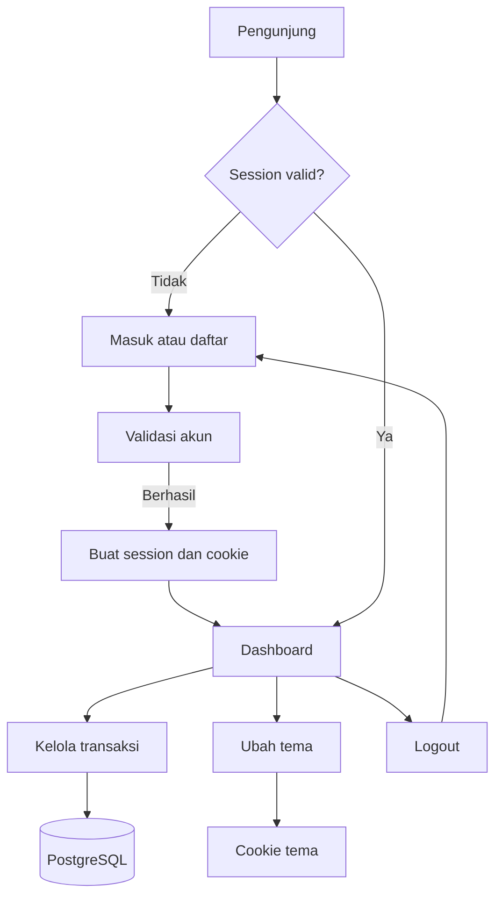
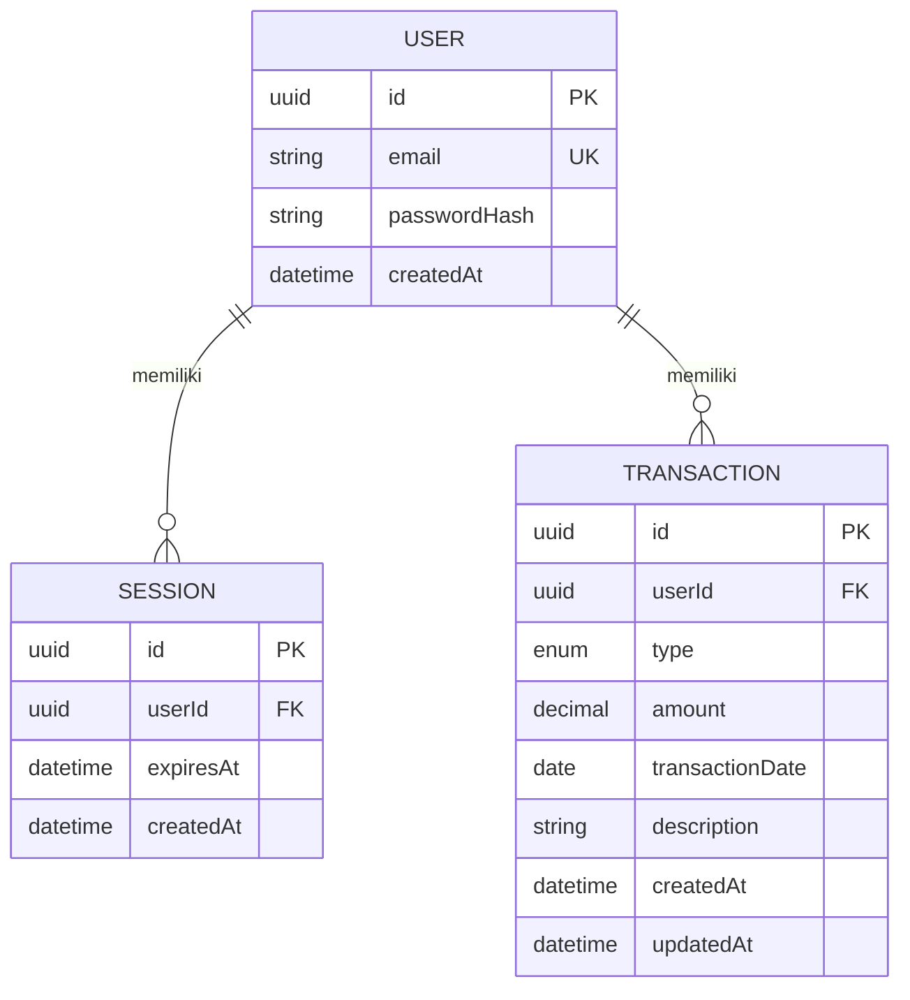

# MoneyLover

Expense tracker sederhana untuk mahasiswa. Setiap pengguna hanya dapat melihat dan mengelola transaksi pada akunnya sendiri.

## Fitur

| Area | Yang tersedia |
| --- | --- |
| Akun | Daftar dengan email/password, masuk, dan logout. |
| Dashboard | Saldo, total pemasukan, total pengeluaran, dan riwayat transaksi terbaru. |
| Transaksi | Tambah, lihat, ubah, hapus, serta filter pemasukan/pengeluaran. |
| Session | Dashboard hanya dapat diakses ketika session masih valid. |
| Tema | Mode terang/gelap yang diingat melalui cookie. |
| Privasi | Seluruh query transaksi dibatasi ke pengguna yang sedang login. |

## Tampilan halaman

Halaman yang tersedia adalah **Masuk**, **Daftar**, dan **Dashboard**. Dashboard berisi ringkasan keuangan, filter transaksi, form tambah/ubah transaksi, serta kontrol tema di header.

### Masuk


### Dashboard: mode terang dan gelap

| Mode terang | Mode gelap |
| --- | --- |
|  |  |

### Form transaksi: mode terang dan gelap

| Mode terang | Mode gelap |
| --- | --- |
|  |  |

## Teknologi

| Bagian | Teknologi |
| --- | --- |
| Frontend | Next.js 16, React 19, TypeScript, Tailwind CSS |
| Database | PostgreSQL dalam Docker |
| ORM | Prisma |
| Autentikasi | Session berbasis database dan cookie |

## Menjalankan secara lokal

### Prasyarat

- Node.js 20+
- Docker Desktop/Docker Engine yang sedang berjalan

### 1. Siapkan environment

```bash
cp .env.example .env
```

Ganti `POSTGRES_PASSWORD` dan nilai terkait pada `.env` sebelum dipakai pada lingkungan bersama atau deployment.

| Variabel | Kegunaan |
| --- | --- |
| `POSTGRES_DB`, `POSTGRES_USER`, `POSTGRES_PASSWORD`, `POSTGRES_PORT` | Konfigurasi PostgreSQL lokal. |
| `DATABASE_URL` | URL koneksi Prisma ke PostgreSQL. |

### 2. Pasang dependensi dan hidupkan database

```bash
npm install
docker compose up -d
```

Port database dibatasi ke `localhost`.

### 3. Siapkan Prisma dan jalankan aplikasi

```bash
npm run db:generate
npm run db:migrate
npm run dev
```

Buka [http://localhost:3000](http://localhost:3000). Pengunjung tanpa session akan diarahkan ke halaman masuk.

### Pemeriksaan opsional

```bash
npm run lint
npm run typecheck
npm run build
```

## Alur aplikasi



## ERD



## Session, tema, dan perlindungan data

| Bagian | Penerapan |
| --- | --- |
| Password | Password tidak disimpan mentah: di-hash dengan `scrypt` dan salt acak. |
| Session | Login membuat record session di database dan cookie `session_id` yang berlaku 7 hari. |
| Cookie session | Menggunakan `HttpOnly`, `SameSite=Lax`, path `/`, serta `Secure` pada production. Cookie tidak memuat email atau data keuangan. |
| Halaman terlindungi | Dashboard memvalidasi session di sisi server; session kedaluwarsa/tidak valid diarahkan ke login. |
| Isolasi transaksi | Server memakai `userId` dari session saat mengambil, mengubah, atau menghapus transaksi. Pemilik transaksi tidak dikirim dari form. |
| Logout | Record session dan cookie session dihapus sebelum pengguna kembali ke login. |
| Tema terang/gelap | Tombol header menyimpan `light` atau `dark` pada cookie `theme` selama satu tahun. Cookie ini hanya menyimpan preferensi visual. |

## Struktur ringkas

```text
app/                 Halaman Next.js, layout, Server Actions
actions/             Aksi autentikasi, transaksi, dan tema
lib/auth/            Password hash dan pengelolaan session
lib/transactions/    Aturan transaksi serta data dashboard
prisma/              Skema dan migration PostgreSQL
docs/Project.md      PRD proyek
docker-compose.yml   PostgreSQL lokal
```

## Perintah

| Perintah | Kegunaan |
| --- | --- |
| `npm run dev` | Menjalankan aplikasi pengembangan. |
| `npm run build` / `npm run start` | Membuat dan menjalankan build production. |
| `npm run lint` / `npm run typecheck` | Pemeriksaan kualitas kode. |
| `npm run db:generate` / `npm run db:migrate` | Membuat Prisma Client dan menerapkan migration. |
