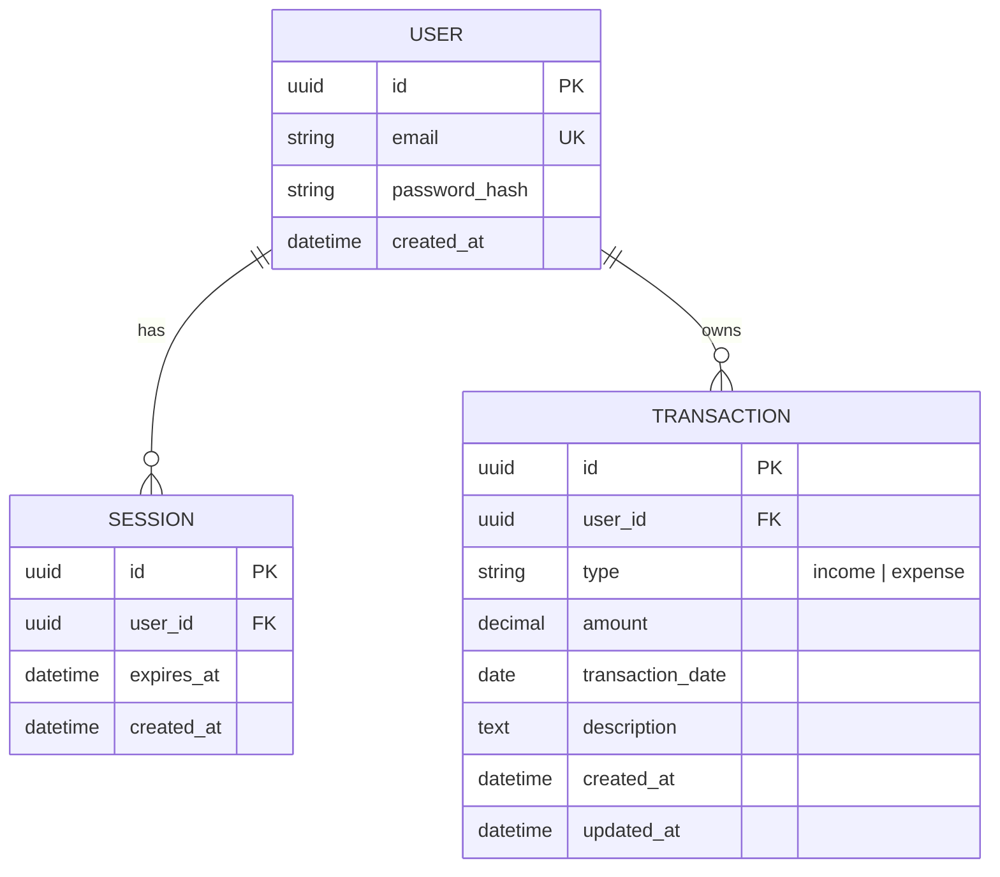

# MoneyLover — Expense Tracker Mahasiswa

## Ringkasan

MoneyLover adalah aplikasi web untuk membantu mahasiswa mengelola keuangan pribadi secara sederhana. Pengguna membuat akun, masuk ke aplikasi, mencatat pemasukan dan pengeluaran, lalu melihat identitas akun, saldo, total pemasukan, total pengeluaran, dan transaksi terbaru pada dashboard.

Setiap transaksi dimiliki oleh satu pengguna. Pengguna hanya dapat melihat dan mengelola transaksi miliknya sendiri.

## Teknologi

| Bagian | Teknologi | Kegunaan |
|---|---|---|
| Aplikasi web | Next.js (App Router) | Halaman, Server Actions, dan proteksi rute. |
| Database | PostgreSQL dalam Docker | Penyimpanan akun, session, dan transaksi secara persisten. |
| Akses database | Prisma | Skema, migrasi, dan query database terparameterisasi. |
| Tampilan | React + CSS/Tailwind yang tersedia di proyek | Form dan dashboard responsif. |

## User Stories

| ID | User story |
|---|---|
| US-01 | Sebagai pengunjung, saya ingin mendaftar dengan email dan password agar dapat memiliki akun MoneyLover. |
| US-02 | Sebagai pengguna, saya ingin login dan logout agar hanya saya yang dapat mengakses area pribadi saya. |
| US-03 | Sebagai pengguna, saya ingin session login tetap aktif saat halaman dimuat ulang agar tidak perlu login berulang kali. |
| US-04 | Sebagai pengguna, saya ingin mengelola **CRUD transaksi** pemasukan dan pengeluaran saya agar catatan keuangan tetap benar. |
| US-05 | Sebagai pengguna, saya ingin melihat dashboard berisi identitas akun, saldo, total pemasukan, total pengeluaran, dan transaksi terbaru agar memahami kondisi keuangan saya. |
| US-06 | Sebagai pengguna, saya ingin memfilter transaksi berdasarkan semua, pemasukan, atau pengeluaran agar riwayat lebih mudah dibaca. |
| US-07 | Sebagai pengguna, saya ingin data transaksi saya tidak dapat diakses pengguna lain agar keuangan pribadi tetap aman. |
| US-08 | Sebagai pengguna, saya ingin satu preferensi tampilan tersimpan di cookie agar pilihan saya tetap digunakan saat membuka ulang aplikasi. |

## Requirement MVP

| Area | Requirement | Batas implementasi sederhana |
|---|---|---|
| Register | Pengunjung dapat membuat akun dengan email unik dan password. | Password disimpan sebagai hash, bukan teks asli. |
| Login & logout | Pengguna dapat login dengan email/password yang valid dan logout dari aplikasi. | Login gagal menampilkan pesan aman tanpa menjelaskan apakah email atau password yang salah. |
| Session | Login membuat session dan melindungi dashboard serta Server Action yang memerlukan autentikasi. | Session tetap valid saat reload selama belum kedaluwarsa; logout menghapus session. |
| Dashboard | Dashboard menampilkan identitas akun, saldo, total pemasukan, total pengeluaran, dan transaksi terbaru. | Untuk MVP, identitas akun dapat ditampilkan dari email pengguna. |
| Transaksi (CRUD) | Pengguna dapat menambah, melihat, mengubah, dan menghapus transaksi miliknya dalam satu alur/form sederhana. | Field: jenis (`income`/`expense`), nominal positif, tanggal, dan keterangan. |
| Filter transaksi | Pengguna dapat memilih filter Semua, Pemasukan, atau Pengeluaran. | Filter hanya mengubah daftar transaksi pengguna yang sedang login; tidak perlu halaman terpisah. |
| Otorisasi | Pengguna hanya boleh membaca, mengubah, dan menghapus transaksi miliknya. | Server mengambil identitas pengguna dari session, bukan `user_id` dari browser. |
| Preferensi cookie | Aplikasi menyimpan satu preferensi pengguna di cookie. | Tetapkan tema `light`/`dark`; cookie ini tidak dipakai untuk login. |
| Validasi & umpan balik | Jenis transaksi wajib valid, nominal harus lebih dari nol, dan tanggal wajib diisi. | Form menampilkan pesan berhasil/gagal; hapus meminta konfirmasi. |
| Tampilan | Login, register, dashboard, dan form transaksi dapat dipakai di ponsel maupun desktop. | Cukup responsif dasar, label jelas, dan tidak ada horizontal scroll. |

## Session, Cookie, dan Data Sensitif

| Item | Ketentuan |
|---|---|
| Cookie session | Cookie hanya menyimpan ID session acak. Gunakan `HttpOnly`, `SameSite=Lax`, dan `Secure` ketika aplikasi berjalan melalui HTTPS. |
| Validasi session | Setiap halaman atau aksi privat memvalidasi session di server sebelum membaca atau mengubah data. |
| Cookie preferensi | Menyimpan hanya nilai tema `light` atau `dark`. Cookie preferensi terpisah dari cookie session dan bukan bukti autentikasi. |
| Password & rahasia | Password hanya disimpan sebagai hash. `DATABASE_URL`, password PostgreSQL, dan nilai rahasia lain berada di `.env`, tidak di-commit, dan tidak memakai prefix `NEXT_PUBLIC_`. |
| Kepemilikan data | `user_id` transaksi ditentukan dari session yang valid. Browser tidak boleh mengirim atau memilih pemilik transaksi. |
| Database Docker | PostgreSQL dipakai untuk pengembangan lokal dan port database dibatasi ke `127.0.0.1`; database tidak diekspos ke publik. |

## ERD

Session disimpan di database agar dapat divalidasi dan diakhiri saat logout. Cookie browser hanya membawa ID session, bukan password atau data transaksi. Preferensi tema tetap berada di cookie lokal sehingga tidak memerlukan tabel.

| Relasi / aturan | Ketentuan |
|---|---|
| `USER` → `SESSION` | Satu pengguna dapat memiliki nol atau lebih session; satu session hanya milik satu pengguna. |
| `USER` → `TRANSACTION` | Satu pengguna dapat memiliki nol atau lebih transaksi; satu transaksi hanya milik satu pengguna. |
| Saldo | `total income - total expense` dari transaksi pengguna yang sedang login. Saldo boleh negatif. |
| Riwayat | Transaksi ditampilkan terbaru lebih dahulu berdasarkan tanggal transaksi dan waktu pembuatan. |

## Pembagian Kerja

Inisialisasi Next.js, Docker PostgreSQL, Prisma, environment, dan skema database dasar sudah tersedia. Keduanya fokus menyelesaikan fitur produk, bukan mengulang setup atau mengubah infrastruktur. Setiap developer memiliki direktori sendiri; jangan mengubah file milik developer lain tanpa menyepakati perubahan kontrak terlebih dahulu.

| Developer | Fokus | File yang dimiliki |
|---|---|---|
| **Yuma** | Fitur akun dan session secara utuh: register, login, logout, proteksi rute, serta validasi pengguna aktif. | `src/app/(auth)/**`, `src/app/page.tsx`, `src/actions/auth/**`, `src/lib/auth/**`, `src/lib/users/**`, dan `middleware.ts`. |
| **Fritz** | Fitur keuangan secara utuh: dashboard, CRUD transaksi, filter, ringkasan, tema, dan responsivitas. | `src/app/(dashboard)/**`, `src/actions/transactions/**`, `src/lib/transactions/**`, `src/app/layout.tsx`, `src/app/globals.css`, `src/components/dashboard/**`, `src/components/transactions/**`, dan `src/components/preferences/**`. |

### Tugas Detail

| Developer | Tugas yang harus selesai |
|---|---|
| **Yuma** | Membuat halaman dan Server Action register/login/logout; hash password; membuat, membaca, dan menghapus cookie session; memvalidasi session; mengarahkan pengguna tanpa session dari dashboard ke login; serta menyediakan fungsi `requireSession` untuk fitur Fritz. |
| **Fritz** | Membuat dashboard dengan identitas akun, kartu ringkasan, transaksi terbaru, empty state, filter jenis, form CRUD, konfirmasi hapus, dan toggle tema berbasis cookie. Semua operasi transaksi menggunakan Prisma melalui domain `transactions` dan wajib memanggil `requireSession` dari Yuma. |

## Kontrak Integrasi Yuma ↔ Fritz

Yuma tidak mengubah komponen dashboard Fritz. Fritz tidak mengatur cookie session dan tidak menerima `user_id` dari browser. Fritz boleh memakai Prisma hanya di domain `src/lib/transactions/**`, setelah memanggil `requireSession`. Keduanya memakai kontrak berikut.

| Kontrak | Input | Output yang disepakati | Pemilik |
|---|---|---|---|
| `register` | `email`, `password` | `{ ok, message, fieldErrors? }` | Yuma |
| `login` | `email`, `password` | `{ ok, message }`; session dibuat bila berhasil | Yuma |
| `logout` | Tidak ada | Session dihapus dan pengguna kembali ke login | Yuma |
| `requireSession` | Tidak ada dari browser | `{ userId, userEmail }` atau redirect/penolakan bila session tidak valid | Yuma |
| `getDashboardData` | Tidak ada dari browser | `{ userEmail, totalIncome, totalExpense, balance, transactions }` untuk pengguna yang sedang login | Fritz, memakai `requireSession` |
| `createTransaction` | `type`, `amount`, `transactionDate`, `description` | `{ ok, message, fieldErrors? }` | Fritz, memakai `requireSession` |
| `updateTransaction` | `id`, `type`, `amount`, `transactionDate`, `description` | `{ ok, message, fieldErrors? }` | Fritz, memakai `requireSession` |
| `deleteTransaction` | `id` | `{ ok, message }` | Fritz, memakai `requireSession` |
| Tampilan filter | Daftar transaksi dari `getDashboardData` dan pilihan filter | Hanya menampilkan data yang sesuai di UI | Fritz |
| Toggle tema | Nilai `light`/`dark` | Menulis cookie preferensi dan menerapkan tema | Fritz |

### Aturan Merge

| Situasi | Aturan |
|---|---|
| Perlu mengubah bentuk `requireSession` atau alur session | Yuma memberi tahu Fritz terlebih dahulu; kontrak di atas diperbarui sebelum kode di-merge. |
| Perlu data baru di dashboard | Fritz menambahkannya di domain `transactions` tanpa mengubah autentikasi Yuma. |
| Perubahan skema database atau infrastruktur yang sudah ada | Dibahas dan dikerjakan bergantian; bukan bagian dari tugas fitur default. |
| Konflik pada file bersama | Jangan merge sendiri. Sepakati satu pemilik untuk perubahan tersebut atau lakukan perubahan bergantian. |

## Kriteria Selesai

| ID | Kondisi selesai |
|---|---|
| AC-01 | Pengunjung dapat register, login, dan logout; email duplikat serta login tidak valid ditolak dengan pesan aman. |
| AC-02 | Dashboard dan aksi transaksi tidak dapat diakses tanpa session valid. |
| AC-03 | Session tetap aktif saat reload dan berakhir setelah logout atau kedaluwarsa. |
| AC-04 | Pengguna dapat melakukan CRUD transaksi sendiri dan melihat perubahan pada riwayat serta ringkasan. |
| AC-05 | Filter Semua/Pemasukan/Pengeluaran bekerja pada transaksi pengguna yang sedang login. |
| AC-06 | Pengguna tidak dapat membaca, mengubah, atau menghapus transaksi milik pengguna lain. |
| AC-07 | Tema terang/gelap tersimpan di cookie preferensi dan tetap diterapkan setelah halaman dimuat ulang. |
